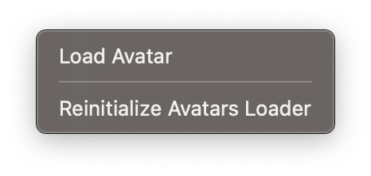
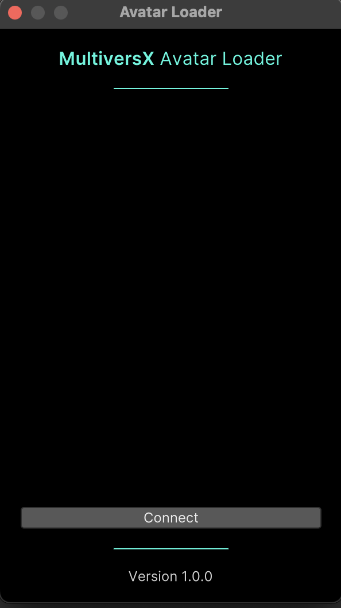
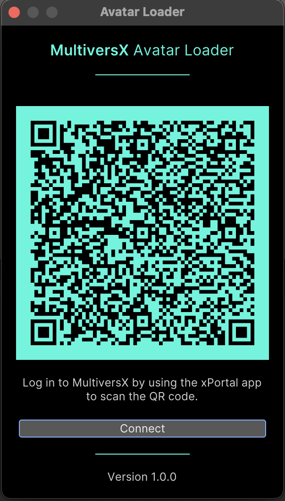
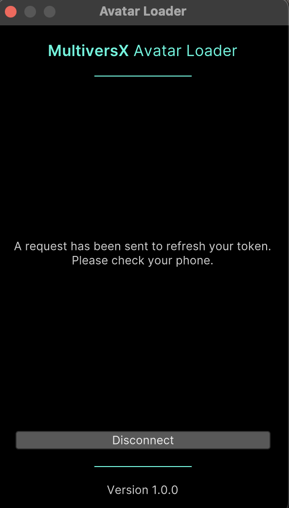
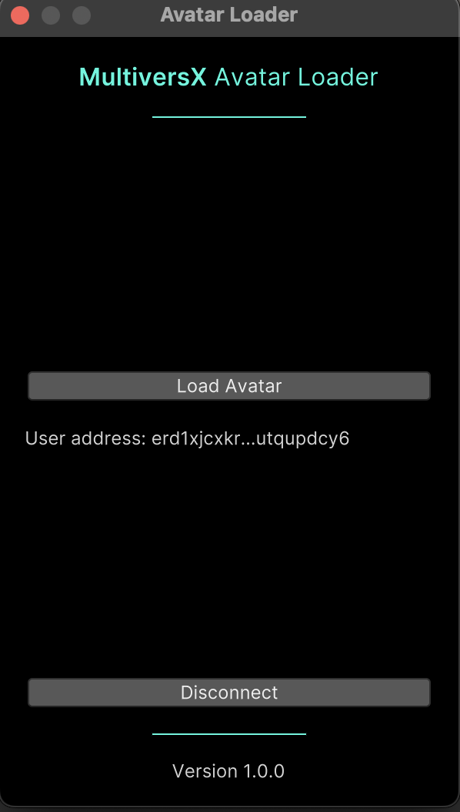
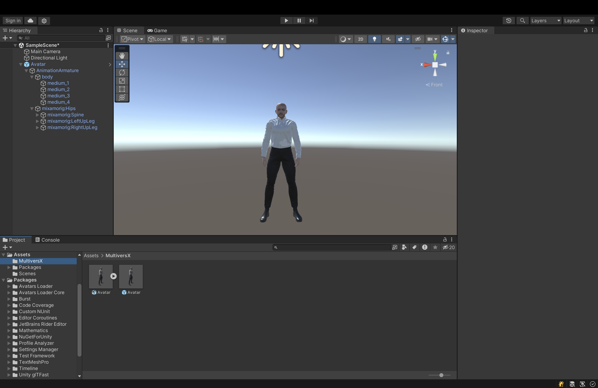

# Avatars Loader

## About

This is a Unity package named "Avatars Loader" (`multiversx.avatar.loader`). This package is used to load 3D avatar NFTs from the MultiversX network. It fetches the NFT GLB file and creates a prefab from it.

## Dependencies

- Avatars Loader Core (`multiversx.avatar.core`)

## Installation

This package is automatically installed when you install the "Avatars Loader Core" package.

### Manual Installation

If you need to manually install this package, you can do so via Unity's Package Manager:

1. Open your Unity project.
2. Navigate to `Window` > `Package Manager`.
3. Click the `+` button and select `Add package from git URL`.
4. Enter the following URL: `https://github.com/multiversx/mx-unity-avatar-loader.git`
5. Click `Add`.

## Usage

After installing this package, you will be able to load 3D avatar NFTs from the MultiversX network into your Unity project. The package will handle fetching the NFT GLB file and converting it into a usable Unity prefab.

Detailes steps:

1. Click the 'Multiversx' option in the Unity Toolbar and select 'Load Avatar'.

2. Click 'Connect' button to initialize wallet connect and wait for the qr code to pop up.

3. Scan the QR Code using your xPortal app.

4. Accept the request to refresh your token in xPortal.

5. Wait for the avatar to be imported in your Unity Project. (You can mannualy reload the avatar)

6. The avatar is ready to use!

## Version

The current version of the package is 1.0.0
